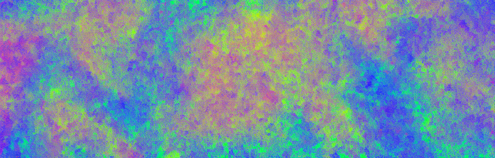

# vgg
A PyTorch implementation of [Very Deep Convolutional Networks For Large-Scale Image Recognition](https://arxiv.org/pdf/1409.1556.pdf)



 
### Installation
```
git clone https://github.com/andregaio/vgg.git
cd vgg
conda create -n vgg python=3.8
conda activate vgg
pip install -r requirements.txt
```
### Models
- VGG-A
- VGG-A-LRN
- VGG-B
- VGG-C
- VGG-D
- VGG-E

### Dataset
- [CIFAR10](https://pytorch.org/vision/stable/generated/torchvision.datasets.CIFAR10.html)

### Training
```
python train.py --model vgg_A --dataset cifar10
```

### Eval
```
python eval.py --model vgg_A --weights weights/checkpoint_00070.pt --dataset cifar10
```

### Inference
```
python infer.py --model vgg_A --weights weights/checkpoint_00070.pt --image assets/cat.png
```

### Results


### Notes
This implementation is not designed to be a complete replica of the original paper - the main differences are:
 - **Batchnorm** layers have been added prior to each activation
 - **Hyperparamters** have been modified (i.e., learning rate)
 - **Accuracy** has been used to evaluate classification performance
 - Has been trained on **CIFAR10**
 - Input resolution has been changed to **32x32** match dataset