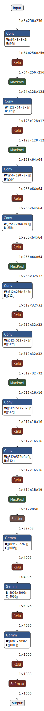
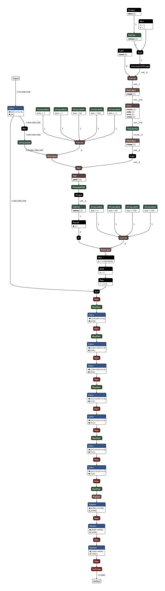
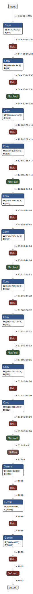
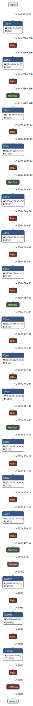
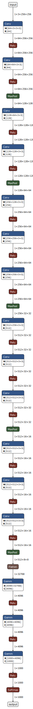
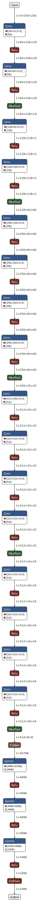

# PyTorch implementation of [Very Deep Convolutional Networks For Large-Scale Image Recognition](https://arxiv.org/pdf/1409.1556.pdf)

# Architecture

## VGG-A

## VGG-A-LRN

## VGG-B

## VGG-C

## VGG-D

## VGG-E

